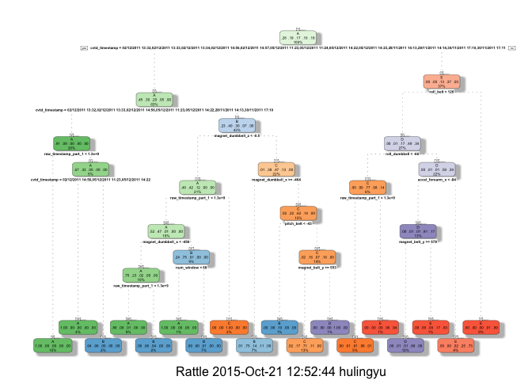

# Pratical Machine Learning write-up Project
lingyu hu  
October 21, 2015  
### Background Introduction
This is the R markdown file of the course project for the Pritical Machine Learning class. Using devices such as Jawbone Up, Nike FuelBand, and Fitbit it is now possible to collect a large amount of data about personal activity relatively inexpensively. These type of devices are part of the quantified self movement ??? a group of enthusiasts who take measurements about themselves regularly to improve their health, to find patterns in their behavior, or because they are tech geeks. One thing that people regularly do is quantify how much of a particular activity they do, but they rarely quantify how well they do it.In this project,using the data data from accelerometers on the belt, forearm, arm, and dumbell of 6 participants,a model is bulit to predict the manner in which they did the exercise.

###Data Sources
The training data for this project are available here:

https://d396qusza40orc.cloudfront.net/predmachlearn/pml-training.csv

The test data are available here:

https://d396qusza40orc.cloudfront.net/predmachlearn/pml-testing.csv

The data for this project comes from this original source: http://groupware.les.inf.puc-rio.br/har.
### Load the required packages

```r
library(rpart)
library(caret)
```

```
## Warning: package 'caret' was built under R version 3.1.3
```

```
## Loading required package: lattice
## Loading required package: ggplot2
```

```
## Warning: package 'ggplot2' was built under R version 3.1.3
```

```r
library(rattle)
```

```
## Warning: package 'rattle' was built under R version 3.1.2
```

```
## Rattle: A free graphical interface for data mining with R.
## Version 3.4.1 Copyright (c) 2006-2014 Togaware Pty Ltd.
## Type 'rattle()' to shake, rattle, and roll your data.
```

```r
library(randomForest)
```

```
## Warning: package 'randomForest' was built under R version 3.1.1
```

```
## randomForest 4.6-10
## Type rfNews() to see new features/changes/bug fixes.
```

```r
set.seed(12345)
```
### Download and read the files

```r
trainurl<-"http://d396qusza40orc.cloudfront.net/predmachlearn/pml-training.csv"
testurl<-"http://d396qusza40orc.cloudfront.net/predmachlearn/pml-testing.csv"
download.file(trainurl,"~/coursera/train1.csv",method="curl")
download.file(testurl,"~/coursera/test1.csv",method="curl")
training<-read.csv("~/coursera/train1.csv")
testing<-read.csv("~/coursera/test1.csv")
```
###Partioning the training into testing and training sets

```r
intrain<-createDataPartition(training$classe,p=0.6,list=FALSE)
mytraining<-training[intrain,]
mytesting<-training[-intrain,]
```
### Remove the data with near zero variance

```r
nzv<-nearZeroVar(mytraining,saveMetrics=TRUE)
zerovar<-subset(nzv,nzv==TRUE)
zvnames<-rownames(zerovar)
zvar<-names(mytraining) %in% c(zvnames)
mytraining<-mytraining[!zvar]
mytraining<-mytraining[,-1]
dim(mytraining)
```

```
## [1] 11776   108
```
### Clean the data with too many NAs
There are some variables with NA datas, which will cause problems in the predictions we are going to take, so we remove the varibles which have more than 60% NA datas. 

```r
isnas<-sapply(mytraining,is.na)
nanum<-colMeans(isnas)
istrue<-nanum>0.6
toonas<-nanum[istrue==TRUE]
nasname<-names(mytraining) %in% c(names(toonas))
mytraining<-mytraining[!nasname]
dim(mytraining)
```

```
## [1] 11776    58
```
### Clean the data in mytesting and testing sets
To do the prediction, we clean the mytesting and testing data as we did to the mytraining data.

```r
clean1<-colnames(mytraining)
mytesting<-mytesting[clean1]
dim(mytesting)
```

```
## [1] 7846   58
```

```r
clean2<-colnames(mytraining[,-58])
testing<-testing[clean2]
dim(testing)
```

```
## [1] 20 57
```
To make sure that the class of testing data is the same of mytraining data, we use the sample method to solve the problem.

```r
testing <- rbind(mytraining[7, -58] , testing)
testing<-testing[-1,]
```
### Use the tree plot

```r
modelrpart<-rpart(classe~.,method="class",data=mytraining)
fancyRpartPlot(modelrpart)
```

 
### Do the prediction in mytesting

```r
prerpart<-predict(modelrpart,mytesting,type="class")
confusionMatrix(prerpart,mytesting$classe)
```

```
## Confusion Matrix and Statistics
## 
##           Reference
## Prediction    A    B    C    D    E
##          A 2150   60    7    1    0
##          B   61 1260   69   64    0
##          C   21  188 1269  143    4
##          D    0   10   14  857   78
##          E    0    0    9  221 1360
## 
## Overall Statistics
##                                           
##                Accuracy : 0.8789          
##                  95% CI : (0.8715, 0.8861)
##     No Information Rate : 0.2845          
##     P-Value [Acc > NIR] : < 2.2e-16       
##                                           
##                   Kappa : 0.8468          
##  Mcnemar's Test P-Value : NA              
## 
## Statistics by Class:
## 
##                      Class: A Class: B Class: C Class: D Class: E
## Sensitivity            0.9633   0.8300   0.9276   0.6664   0.9431
## Specificity            0.9879   0.9693   0.9450   0.9845   0.9641
## Pos Pred Value         0.9693   0.8666   0.7809   0.8936   0.8553
## Neg Pred Value         0.9854   0.9596   0.9841   0.9377   0.9869
## Prevalence             0.2845   0.1935   0.1744   0.1639   0.1838
## Detection Rate         0.2740   0.1606   0.1617   0.1092   0.1733
## Detection Prevalence   0.2827   0.1853   0.2071   0.1222   0.2027
## Balanced Accuracy      0.9756   0.8997   0.9363   0.8254   0.9536
```
### Using ML algorithms for prediction: Random Forests

```r
modelrf<-randomForest(classe~.,data=mytraining)
prerf<-predict(modelrf,mytesting)
confusionMatrix(prerf,mytesting$classe)
```

```
## Confusion Matrix and Statistics
## 
##           Reference
## Prediction    A    B    C    D    E
##          A 2231    2    0    0    0
##          B    1 1516    2    0    0
##          C    0    0 1366    3    0
##          D    0    0    0 1282    2
##          E    0    0    0    1 1440
## 
## Overall Statistics
##                                           
##                Accuracy : 0.9986          
##                  95% CI : (0.9975, 0.9993)
##     No Information Rate : 0.2845          
##     P-Value [Acc > NIR] : < 2.2e-16       
##                                           
##                   Kappa : 0.9982          
##  Mcnemar's Test P-Value : NA              
## 
## Statistics by Class:
## 
##                      Class: A Class: B Class: C Class: D Class: E
## Sensitivity            0.9996   0.9987   0.9985   0.9969   0.9986
## Specificity            0.9996   0.9995   0.9995   0.9997   0.9998
## Pos Pred Value         0.9991   0.9980   0.9978   0.9984   0.9993
## Neg Pred Value         0.9998   0.9997   0.9997   0.9994   0.9997
## Prevalence             0.2845   0.1935   0.1744   0.1639   0.1838
## Detection Rate         0.2843   0.1932   0.1741   0.1634   0.1835
## Detection Prevalence   0.2846   0.1936   0.1745   0.1637   0.1837
## Balanced Accuracy      0.9996   0.9991   0.9990   0.9983   0.9992
```
### Conclusion
From the accurancy we can get the conclusion that the randomforest get the better results.so we use the randomforset.

___________________________
### The Final Prediction
Run the randomforset to predict the testing set

```r
prefinal<-predict(modelrf,testing)
prefinal
```

```
##   2   3   4   5   6   7   8   9  10  11  12  13 141  15  16  17  18  19 
##   B   A   B   A   A   E   D   B   A   A   B   C   B   A   E   E   A   B 
##  20  21 
##   B   B 
## Levels: A B C D E
```
